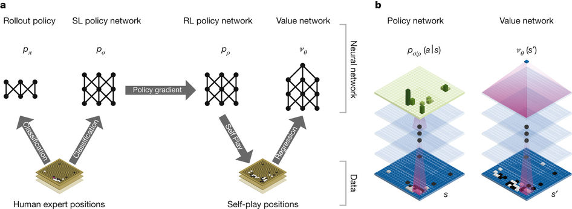

# Research Review

Feitong Yang

> Paper: Silver, et al (2016). Mastering the game of Go with deep neural networks and tree search. Nature, 529(7587), 484-489.

Alpha Go is a deep network system that learns to play the game Go and defeated human professional players who ranked as 2nd Dan. This is the first time that a computer program can beat a professional Go player, a feat that was thought to be too difficult to achieve.

The Go game is a perfect information, zero-sum game that has an astronomical number of possible states. The whole search tree is approximately 150 in depth and 250 in breadth. It's impossible to search through the whole state space, so it is important to prune the search space. Similar to what we learn in the minimax algorithm and alpha-beta pruning, we need to truncate the depth by evaluating the outcome from a board state `s`, and prune the breadth by wisely choose an action `a` at the board state `s`.

The first component of Alpha Go is the **policy network**. The **policy network** provides a probabilistic distribution of possible actions, namely the legal stone locations, for a given board state. The network guides Alpha Go to more likely choose a good action over a poor one. However, it is hard to know what policies are good policies. Therefore, Alpha Go uses a supervised learning algorithm to train a multilayer convolutional neural network to learn the association between a board state and a distribution of actions from 30 million positions from online human game plays. Deep convolutional neural networks are used in many other tasks, such as image recognitions, and have achieved super-human performance in these fields. Here in the Go game, this architecture also learns the state-action association better than other learning algorithms and achieves 57% accuracy in predicting human actions given a board state, much higher than a previous performance of 44.4% accuracy. This supervised learning network sets a good start to tell the whole system where to place the next stone.

Next, Alpha Go improves its policy network based on a reinforcement learning algorithm. Such an algorithm starts with the previous network from the supervised learning and updates the weights in the network by having Alpha Go play with itself. For each self-play, the reinforcement learning algorithm improves the probability distribution of action selection based on the results of the gameplay. If an action leads to a winning in a self-play, the policy network would update its weights such that this action is more likely to be chosen given the same board state. Such a reinforcement learning leads to an even better policy network.

At the same time, the reinforcement learning also updates a **valuation network** to truncate the search depth. Similar to score functions in the minimax algorithm, the valuation network is also a function that approximates the outcome of the current board state and evaluates whether the current board state more likely leads to a winning state or a losing state. What is new here is such a valuation function is also a multilayer convolutional neural network. It maps a board state to a single value `v` to represent the expected outcome of the current state. In contrast to previous score functions that are handcrafted, such as the ones we make in the adversarial game project, the valuation network in Alpha Go is also trained from the reinforcement learning algorithm. In order to learn such a network, the Alpha Go plays against itself and calculates the expected value of a state given all its actions. Note that, a winning state has a deterministic value of 1, and a losing state has a value of -1. Training such a valuation network is possible because Alpha Go uses the Monte Carlo tree search (MCTS) strategies to quickly sample actions and roll out the games to a result. By multiple simulations, such a MCTS method can approximately calculates the expectation of the outcome of the current state, which in turn is an approximation of the real outcome. This double approximation will converge asymptotically given a large number of simulations.

After learning from previous human moves and from self-plays, Alpha Go uses the policy network and the valuation network in the real gameplay. It places a stone probabilistically based on the policy network, and truncates the depth of the search tree and use the valuation network to approximate the outcomes. In such a way, Alpha Go can prune the search tree significantly and choose a winning move successfully.

With the help of the new architecture of deep neural networks and the new training algorithms, the Alpha Go system can win 99.8% to 100% games against other available Go programs. Even when alpha Go plays with four handicap stones, a rule that is advantageous to its opponents, it still wins 77% to 99% of the games against its opponents. Th most amazing achievement of Alpha Go is that it wins 5 out of 5 games against a professional 2nd Dan player, who is also the European champion. Later, an upgraded version of Alpha GO won 5 out of 5 games against current World's best Go player.
